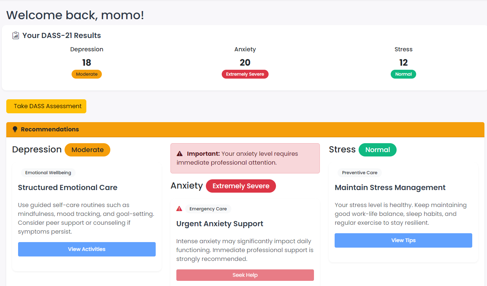
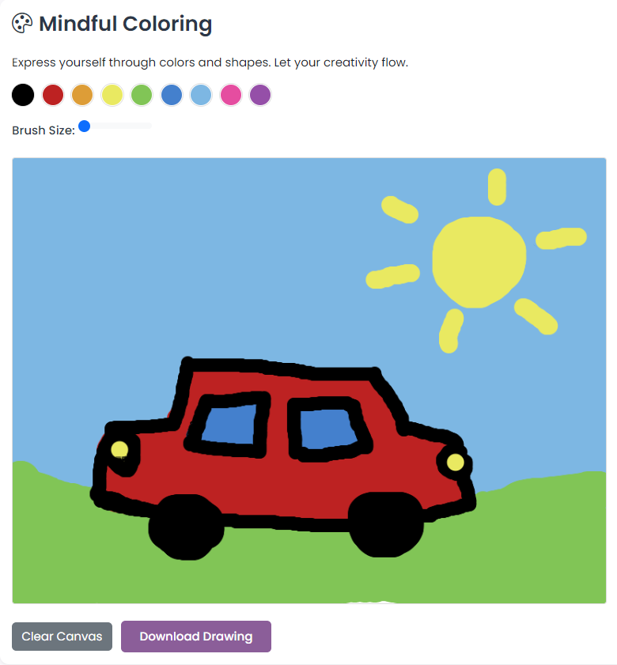
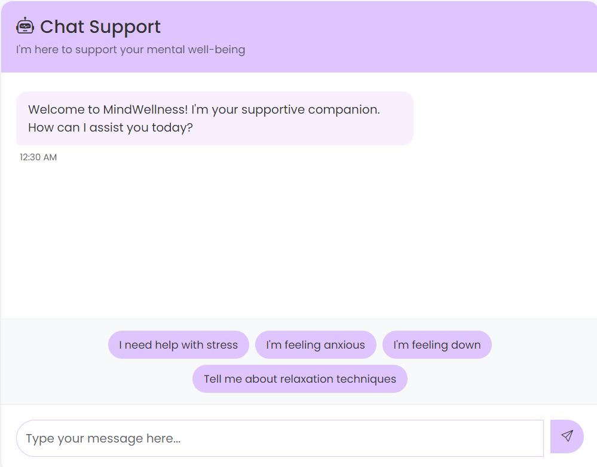

# MindWellness 

MindWellness is a frontend mental wellness web application designed to help users better understand their emotional well-being through self-assessment and tailored recommendations.

## Live Demo
🔗 https://arysamht.github.io/MindWellness/

## 

   
  <b>Dashboard</b>

   
  <b>Journal</b>

   
  <b>Mindful Coloring</b>

   
  <b>Chatbot</b>

## Features
- Depression, Anxiety, and Stress self-assessment
- Severity-based results (Mild, Moderate, Severe, Extremely Severe)
- Personalized recommendations generated on the frontend

## Technologies Used
- HTML5
- CSS3
- JavaScript
- Bootstrap

## How It Works
1. Users complete a self-assessment questionnaire
2. Scores are calculated on the frontend
3. Severity levels are determined
4. Relevant recommendations are displayed based on severity

## Disclaimer
This application is for **educational and informational purposes only**.  
It is **not a medical diagnostic tool** and does not replace professional mental health care.
